<p align="center">
    
</p>

<H2><p align="Center">TECNOLÓGICO NACIONAL DE MÉXICO</p></H2>

<H2><p align="Center">INSTITUTO TECNOLÓGICO DE TIJUANA</p></H2>

<H2><p align="Center">SUBDIRECCIÓN ACADÉMICA</p></H2>

<H2><p align="Center">DEPARTAMENTO DE SISTEMAS Y COMPUTACIÓN</p></H2>

<H2><p align="Center">NOMBRE DE LOS ALUMNOS: </p></H2>

<H2><p align="Center">GALAVIZ LONA OSCAR EDUARDO (N.CONTROL: 17212993)</p></H2>

<H2><p align="Center">MARQUEZ MILLAN SEASHELL VANESSA (N.CONTROL: ) </p></H2>

<H2><p align="Center">Carrera: Ingeniería Informática</p></H2>

<H2><p align="Center">Semestre: 9no </p></H2>

<H2><p align="Center">MATERIA: Datos Masivos</p></H2>

<H2><p align="Center">PROFESOR: JOSE CHRISTIAN ROMERO HERNANDEZ</p></H2>

<H2><p align="Center">Practica evaluatoria 1</p></H2>

<H2><p align="Center">Unidad 1</p></H2>

<br>
<br>
<br>
<br>
<br>
<br>
<br>
<br>


---
### Desarrollo

<br><br>

  **1-.SPARK session** <br>

Only start SPARK with the comand 
```scala 
SPARK-SHELL
```
  <p >
    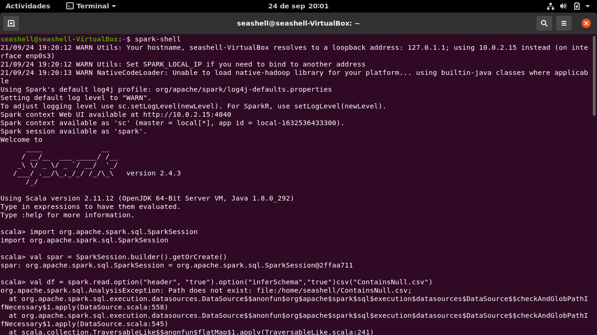
</p>

<br><br>

**2-. File Netflix Stock CSV** <br>

First need import the library, and is important you have the dataFrame in this address "/home/"name computer"/"name dataFrame" because the comand stearchh the archive here, then only print the data types
```scala 
import org.apache.spark.sql.SparkSession

val spark = SparkSession.builder().getOrCreate()

val df = spark.read.option("header", "true").option("inferSchema","true")csv("Netflix_2011_2016.csv")
df
df.printSchema()
```
  <p >
    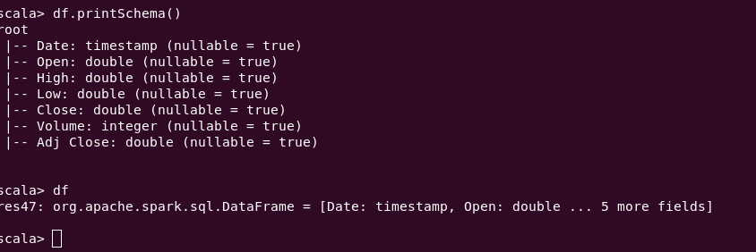
</p>

<br><br>

**3-.Names columns** <br>

Only start SPARK with the comand 
```scala 
df.columns
```
  <p >
    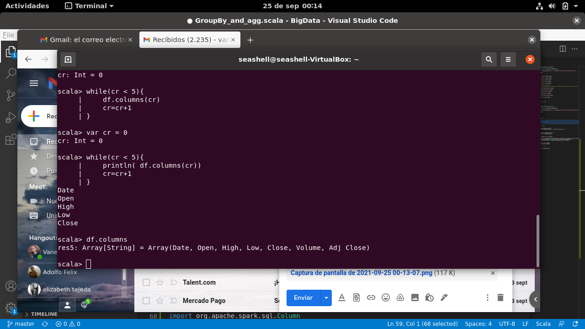
</p>

<br><br>

**4-.Schema** <br>

For know thw schema only need the dataFrame and the next reserverd word, is for can you know the structure and the types of each column
```scala 
df.printSchema()
```
  <p >
    
</p>

<br><br>

**5-Print first 5 columns** <br>

For that need create a variable inthis case cr and i say is equals to 0, then use while for create a bucle ever cr is less than 5, print the columns  and increase cr if i don't do that is a infinite bucle
```scala 
var cr = 0
while(cr < 5){
    println( df.columns(cr))
    cr=cr+1
}
```
  <p >
    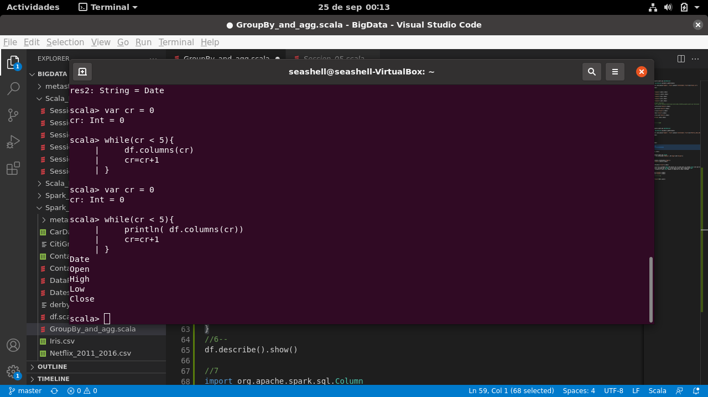
</p>

<br><br>

**6-.Uses describe ()** <br>

That comand is for knows more informations about the dataFrame, statistical data
```scala 
df.describe().show()
```
  <p >
    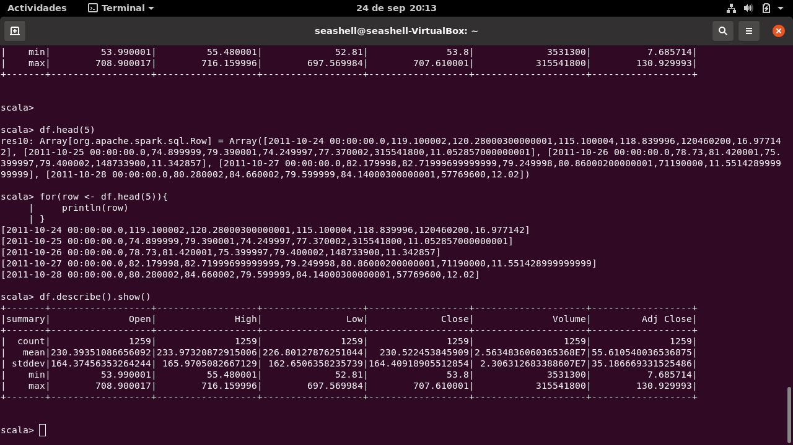
</p>

<br><br>

**7-.Create new DataFrame with new column** <br>

We need create a new dataFrame for can to do some modification so here to make a new column with the relationship of column High and Volume
```scala 
val newData = df.withColumn("HVRatio", df("High")/df("Volume"))
newData.show()
```
  <p >
    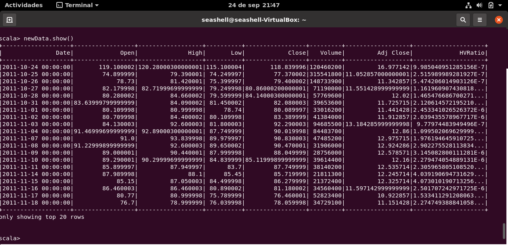
</p>

<br><br>

**8-.Max Open** <br>

We need know the date of the maxium data, so first we order the column Open and save in maxp then select Date of de maxp but only the first row
```scala 
val maxp = newData.orderBy(desc("Open"))
maxp.select("Date").limit(1).show()
```
  <p >
    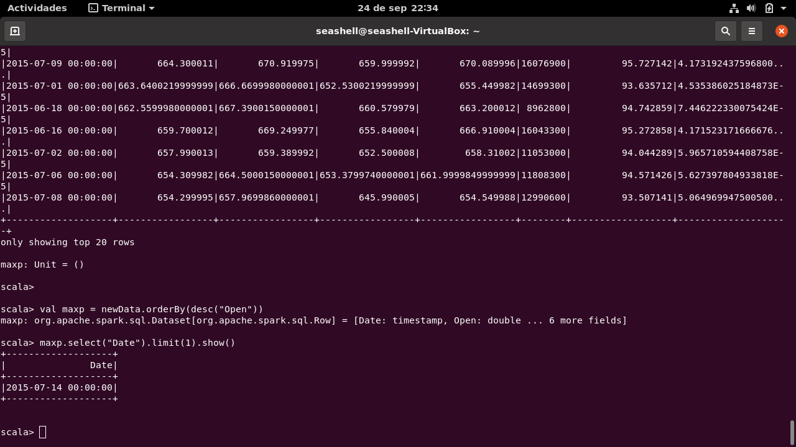
</p>

<br><br>

**9-.Meaning Close in DataFrame** <br>


```scala 
newData.orderBy(desc("Close")).show()
```
 

<br><br>

**10-.Maximum and minimum of Volume** <br>

This is only to know thw first row the most big and the most lowest, and oly select the volume and your minium or maximun
```scala 
df.select(max("Volume")).show()
df.select(min("Volume")).show()
```
  <p >
    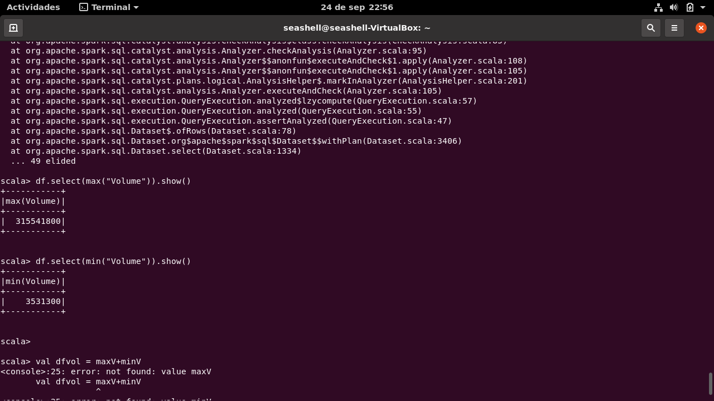
</p>

<br><br>

**11-.With Scala/Spark $ resolve the next** <br><br>

**A-.With Scala/Spark $ resolve the next** <br>
Need to know the data less than numbesr 600 and cout that 
```scala 
df.filter($"Close"<600).count()
```
  <p >
    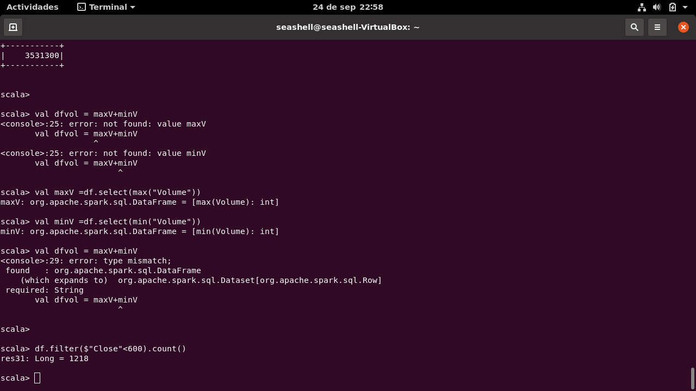
</p>

**B-.**<br>
```scala

val tiempo = df.filter($"High">500).count()
val porcentaje = (tiempo*100)/1259
```
<p>
  
</p>

**C-.We need to know what is the correlation of high and volumen**<br>
```scala
df.select(corr("High","Volume").alias("Correlacion")).show()

```
<p>
  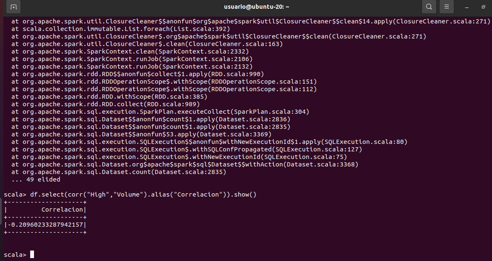
</p>

**D-.We need to know which are the maximun for each year**<br>
```scala
df.groupBy(year(df("Date")).alias("Year")).max("High").sort(asc("Year")).show()

```
<p>
  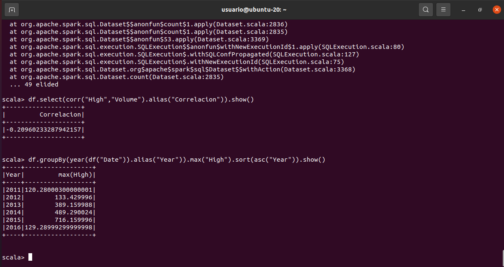
</p>

**E-.This question deals with knowing the average close for each month**<br>
```scala
df.groupBy(month(df("Date")).alias("Month")).avg("Close").sort(asc("Month")).show()

```
<p>
  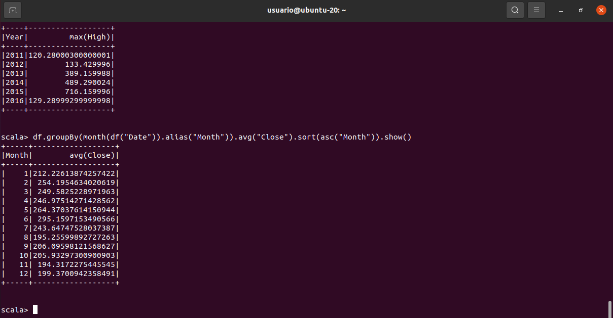
</p>