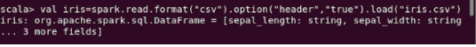
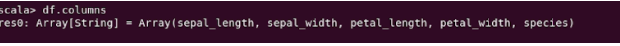
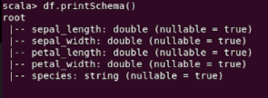
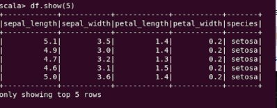
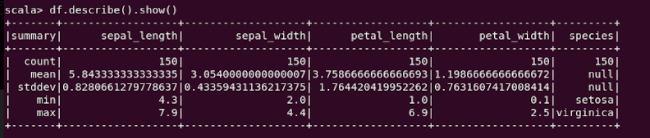
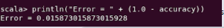

<p align="center">
    
</p>

<H2><p align="Center">TECNOLÓGICO NACIONAL DE MÉXICO</p></H2>

<H2><p align="Center">INSTITUTO TECNOLÓGICO DE TIJUANA</p></H2>

<H2><p align="Center">SUBDIRECCIÓN ACADÉMICA</p></H2>

<H2><p align="Center">DEPARTAMENTO DE SISTEMAS Y COMPUTACIÓN</p></H2>

<H2><p align="Center">NOMBRE DE LOS ALUMNOS: </p></H2>

<H2><p align="Center">GALAVIZ LONA OSCAR EDUARDO (N.CONTROL: 17212993)</p></H2>

<H2><p align="Center">MARQUEZ MILLAN SEASHELL VANESSA (N.CONTROL: ) </p></H2>

<H2><p align="Center">Carrera: Ingeniería Informática</p></H2>

<H2><p align="Center">Semestre: 9no </p></H2>

<H2><p align="Center">MATERIA: Datos Masivos</p></H2>

<H2><p align="Center">PROFESOR: JOSE CHRISTIAN ROMERO HERNANDEZ</p></H2>

<H2><p align="Center">Examen U2</p></H2>

<H2><p align="Center">Unidad 2</p></H2>

<br>
<br>
<br>
<br>
<br>
<br>
<br>
<br>

### Introduccion
Para poder desarrollor esta practica primero debemos tener en cuenta ciertos puntos importantes en este caso se trata sobre las metodos de clasificacion, asi como tomar algunos puntos anteriores de lo ya antes visto, la clasificacion nos permite identificar o saber en el momento de la busqueda de datos especificos que tan probable es que ese dato sea encontrado o que salga, tambien es utilizado para identificar patrones que sean extraños o muy poco comunes dentro de archivo de datos. Estas clasificaciones ademas de permitinos identificar este tipo de patrones, tambien nos permite saber que exactitud tiene este y cuanta probabildad de margen de error tenga este, con el cual podemos identificar si se puede confiar al 100% del modelo o simplemente tomarlo como una opcion al momento del analisis de datos. Los diferentes modelos funcionan de maneras diferentes pero los datos pueden llegar a una concordancia, se puede decir que los modelos de clasificacion sirve para sacar estadisticas e identificar patrones dentro de las empresas que lo solicitan para poder tener un panorama de como se encuentra una empresa

### Development

**extra-.Import the library**
For the first step we need to import the libraries that will allow us to carry out the practice

```scala
import org.apache.spark.sql.types.DoubleType
import org.apache.spark.ml.classification.MultilayerPerceptronClassifier
import org.apache.spark.ml.evaluation MulticlassClassificationEvaluator
import org.apache.spark.ml.feature.IndexToString
import org.apache.spark.ml.feature.StringIndexer
import org.apache.spark.ml.feature.VectorIndexer
import org.apache.spark.ml.feature.VectorAssembler
import org.apache.spark.ml.feature.IndexToString
import org.apache.spark.ml.Pipeline
```

**1-.Load the data iris csv**
We need to load our data deposit that will be used, in this case iris a csv provided for this practice
```scala
val iris=spark.read.format("csv").option("header","true").load("iris.csv")
```
<p>

</p>

**2-.Names colums**
Here we clean the data to create a new dataframe with the necessary information and adding new columns with the requested information and once done, show the name of the columns to verify that it was done.
```scala
//Clean the dataframe
val df = iris.withColumn("sepal_length", $"sepal_length".cast(DoubleType)).withColumn("sepal_width", $"sepal_width".cast(DoubleType)).withColumn("petal_length", $"petal_length".cast(DoubleType)).withColumn("petal_width", $"petal_width".cast(DoubleType))

//2-.Colum names
df.columns
```
<p>

</p>

**3-.Schema**
simply the schema shows us the columns that we add with the type of data they support
```scala
df.printSchema()
```
<p>

</p>

**4-.print first 5 columns**
In this line it only shows us the first 5 columns of dataframe, which are the added ones
```scala
df.show(5)
```
<p>

</p>

**5-.use the method describe**
This method will show us an overview of the dataframe created
```scala
df.describe().show()
```
<p>

</p>

**6-.Transformation and label we have to use**
we create an arrangement where all the fields that we want are analyzed and I come out as features
```scala
val assembler = new VectorAssembler().setInputCols(Array("sepal_length", "sepal_width", "petal_length", "petal_width")).setOutputCol("features")
```
we perform a transformation of our dataframe to send the data in a new dataframe
```scala
val features = assembler.transform(df)
```
we use the stringindexer method to pass the laber column and the indexedlabel, then we send the data to the datraframe features
```scala
val indexerL = new StringIndexer().setInputCol("species").setOutputCol("indexedLabel").fit(features)
val indexerF = new VectorIndexer().setInputCol("features").setOutputCol("indexedFeatures").setMaxCategories(4).fit(features)
```
Finally, we divide the features dataframe in two to be able to carry out the process of using the model, this will be in two, one called trainigData and the other testData
```scala
val splits = features.randomSplit(Array(0.6, 0.4))
val training = splits(0)
val test = splits(1)
```

We establish a neural network layer, of size 4 for the input, 5 and 4 for the intermediate layer and for the output 3
```scala
val layers = Array[Int](4, 5, 5, 3)
```

**7-.Building model**
We create the multilayerperceptronclasifier model and pass it the parameters such as the layers, the size, the randomness seed and the maximum number of interactions.
```scala
val trainer = new MultilayerPerceptronClassifier().setLayers(layers).setLabelCol("indexedLabel").setFeaturesCol("indexedFeatures").setBlockSize(128).setSeed(System.currentTimeMillis).setMaxIter(200)
val converterL = new IndexToString().setInputCol("prediction").setOutputCol("predictedLabel").setLabels(indexerL.labels)
val pipeline = new Pipeline().setStages(Array(indexerL, indexerF, trainer, converterL))

val model = pipeline.fit(training)
```

**8-. print the result of model**
we test the model and show our predictions and how accurate it is
```scala
val predictions = model.transform(test)

val evaluator = new MulticlassClassificationEvaluator().setLabelCol("indexedLabel").setPredictionCol
("prediction").setMetricName("accuracy")
val accuracy = evaluator.evaluate(predictions)
println("Error = " + (1.0 - accuracy))
```
<p>

</p>

### Conclusion
En el desarrollo de esta practica no fue complicado como tal pero si algo laboriosa porque al momento de querer buscar informacion nos daban resultados de ejemplos de spark pero en python y esto se tenia que transformar a codigo scala pero eso no nos detuvo con la documentacion de spark y los ejemplos de algunos compañeros pudimos resolver todas las cuestiones que se tenian y evidentemente tambien tuvimos que entender y comprender el codigo y lo que estabamos haciendo aunque algunas partes del codigo eran partes que ya teniamos presentes por la unidad pasada en conclusion el poder utilizar estos metodos de clasificacion fue satisfactorio porque aprendimos a utilizar un modelo dentro de un archivo de datos que nos permitia tener un analisis estadistico de estos y para tener un interpretacion de los mismo asi como un panorama mas amplio del mismo identificando patrones o datos sobresalientes