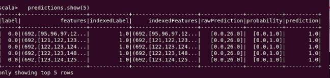
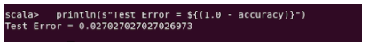

## Ingeniería en sistemas computaciones

### Datos masivos

<p align="center">
    
</p>


### Practica 1 - Decision tree classifier

**Alumnos:** 

Marquez Millan Seashell Vanessa 

Galaviz Lona Oscar Eduardo


<br><br><br><br><br><br><br><br><br>


---

## Developement

The first thing is import all librarys to need in these case was

```scala

import org.apache.spark.ml.Pipeline
import org.apache.sparkmlclassificationDecisionTreeClassificationModel
import org.apache.spark.ml.classification.DecisionTreeClassifier
import org.apache.spark.ml.evaluationMulticlassClassificationEvaluator
import org.apache.spark.ml.feature.{IndexToString, StringIndexer, VectorIndexer}
    
```
Here only load the dataframe(these df you need to have in the principal directory)
```scala
 val data = spark.read.format("libsvm").load("sample.txt")
 ```

 Fit on whole dataset to include all labels in index.
 ```scala
val labelIndexer = new StringIndexer().setInputCol("label").setOutputCol("indexedLabel").fit(data)
 ```

 Automatically identify categorical features, and index them
 ```scala
 val featureIndexer = new VectorIndexer().setInputCol("features").setOutputCol("indexedFeatures").setMaxCategories(4).fit(data) 
 ```

 Split the data into training and test sets (30% held out for testing)
```scala
val Array(trainingData, testData) = data.randomSplit(Array(0.7, 0.3))
```

Train a DecisionTree model
```scala
val dt = new DecisionTreeClassifier().setLabelCol("indexedLabel").setFeaturesCol("indexedFeatures")
```

Chain indexers and tree in a Pipeline.
```scala
val pipeline = new Pipeline().setStages(Array(labelIndexer, featureIndexer, dt))
```

Chain indexers and tree in a Pipeline.
```scala
    val pipeline = new Pipeline().setStages(Array(labelIndexer, featureIndexer, dt))
```
Train model. This also runs the indexers.
```scala
    val model = pipeline.fit(trainingData)
```
Make predictions.
```scala
    val predictions = model.transform(testData)
```
Select example rows to display.
```scala
    predictions.show(5)
```
<p>

</p>

Select (prediction, true label) and compute test error.
```scala
    val evaluator = new MulticlassClassificationEvaluator().setLabelCol("indexedLabel").setPredictionCol("prediction").setMetricName("accuracy")
    val accuracy = evaluator.evaluate(predictions)
    println(s"Test Error = ${(1.0 - accuracy)}")
```
<p>

</p>

