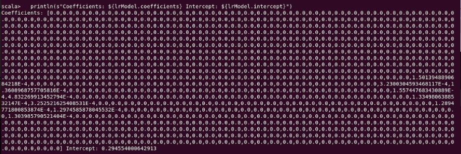
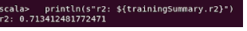
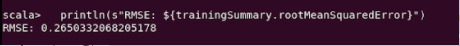
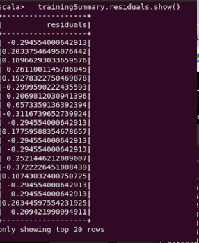
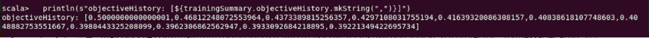
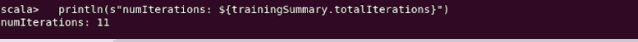

## Ingeniería en sistemas computaciones

### Datos masivos

<p align="center">
    
</p>


### Practica 2 - Linear regression

**Alumnos:** 

Marquez Millan Seashell Vanessa 

Galaviz Lona Oscar Eduardo


<br><br><br><br><br><br><br><br><br>


---

## Developement
The first thing is import all librarys to need in these case was

```scala
import org.apache.spark.ml.regression.LinearRegression
```

Load training data
```scala
val training = spark.read.format("libsvm").load("SampleLivs.txt")
val lr = new LinearRegression().setMaxIter(10).setRegParam(0.3).setElasticNetParam(0.8)
```

Fit the model
```scala
val lrModel = lr.fit(training)
``

Print the coefficients and intercept for linear regression
```scala    
println(s"Coefficients: ${lrModel.coefficients} Intercept: ${lrModel.intercept}")
```


Summarize the model over the training set and print out some metrics
```scala
val trainingSummary = lrModel.summary
println(s"numIterations: ${trainingSummary.totalIterations}")
println(s"objectiveHistory: [${trainingSummary.objectiveHistory.mkString(",")}]")
trainingSummary.residuals.show()
println(s"RMSE: ${trainingSummary.rootMeanSquaredError}")
println(s"r2: ${trainingSummary.r2}")
```
<p>





</p>