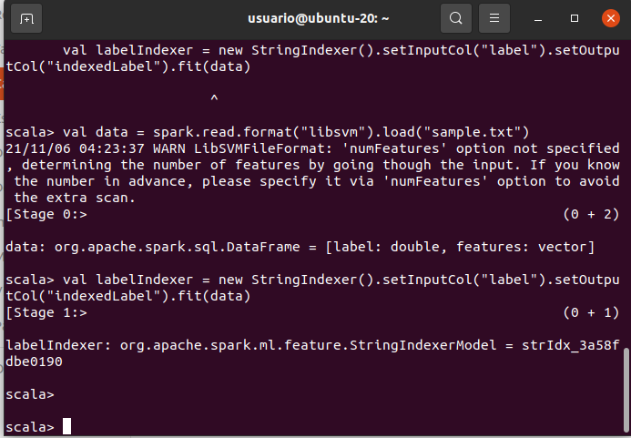
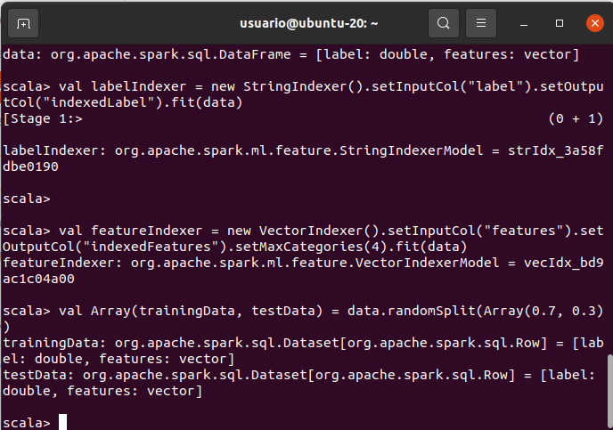
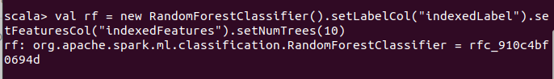
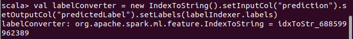
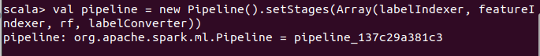
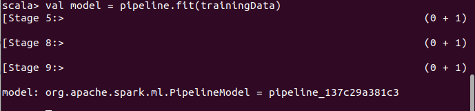
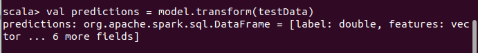
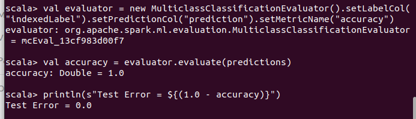
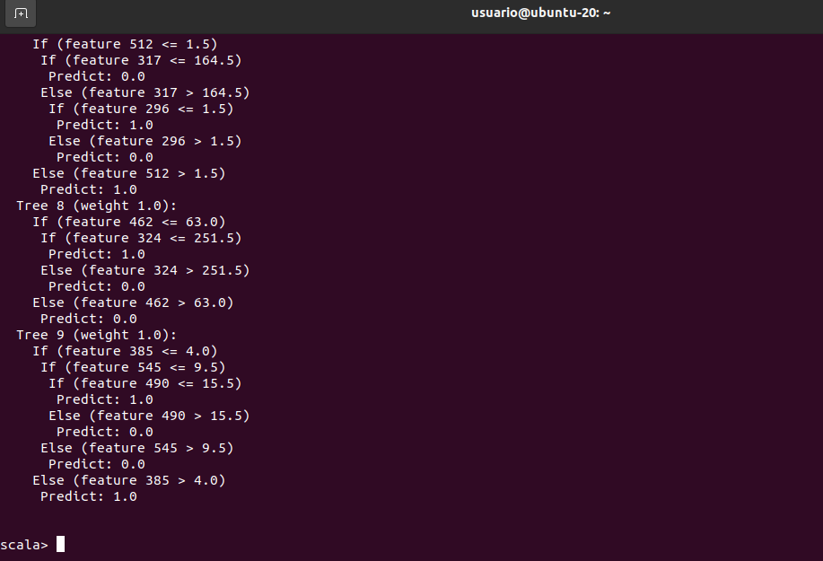

<p align="center">
    
</p>

<H2><p align="Center">TECNOLÓGICO NACIONAL DE MÉXICO</p></H2>

<H2><p align="Center">INSTITUTO TECNOLÓGICO DE TIJUANA</p></H2>

<H2><p align="Center">SUBDIRECCIÓN ACADÉMICA</p></H2>

<H2><p align="Center">DEPARTAMENTO DE SISTEMAS Y COMPUTACIÓN</p></H2>

<H2><p align="Center">NOMBRE DE LOS ALUMNOS: </p></H2>

<H2><p align="Center">GALAVIZ LONA OSCAR EDUARDO (N.CONTROL: 17212993)</p></H2>

<H2><p align="Center">MARQUEZ MILLAN SEASHELL VANESSA (N.CONTROL: ) </p></H2>

<H2><p align="Center">Carrera: Ingeniería Informática</p></H2>

<H2><p align="Center">Semestre: 9no </p></H2>

<H2><p align="Center">MATERIA: Datos Masivos</p></H2>

<H2><p align="Center">PROFESOR: JOSE CHRISTIAN ROMERO HERNANDEZ</p></H2>

<H2><p align="Center">Practica 3</p></H2>

<H2><p align="Center">Unidad 2</p></H2>

<br>
<br>
<br>
<br>
<br>
<br>
<br>
<br>

### Development
we import the libraries that practice requires

```scala
import org.apache.spark.ml.Pipeline
import org.apache.spark.ml.classification.{RandomForestClassificationModel, RandomForestClassifier}
import org.apache.spark.ml.evaluation.MulticlassClassificationEvaluator
import org.apache.spark.ml.feature.{IndexToString, StringIndexer, VectorIndexer}
```
here we load the data from a text file to be the dataframe

```scala

val data = spark.read.format("libsvm").load("sample.txt")

// Index labels, adding metadata to the label column.
// Fit on whole dataset to include all labels in index.
val labelIndexer = new StringIndexer().setInputCol("label").setOutputCol("indexedLabel").fit(data)
```
<p>

</p>

```scala
// Automatically identify categorical features, and index them.
// Set maxCategories so features with > 4 distinct values are treated as continuous.
val featureIndexer = new VectorIndexer().setInputCol("features").setOutputCol("indexedFeatures").setMaxCategories(4).fit(data)

// Split the data into training and test sets (30% held out for testing).
val Array(trainingData, testData) = data.randomSplit(Array(0.7, 0.3))

```
<p>

</p>


Train a RandomForest model.

```scala
val rf = new RandomForestClassifier().setLabelCol("indexedLabel").setFeaturesCol("indexedFeatures").setNumTrees(10)
```
<p>

</p>

Convert indexed labels back to original labels.

```scala
val labelConverter = new IndexToString().setInputCol("prediction").setOutputCol("predictedLabel").setLabels(labelIndexer.labels)
```
<p>

</p>

Chain indexers and forest in a Pipeline.

```scala
val pipeline = new Pipeline().setStages(Array(labelIndexer, featureIndexer, rf, labelConverter))
```
<p>

</p>

Train model. This also runs the indexers.

```scala
val model = pipeline.fit(trainingData)
```
<p>

</p>

Make predictions.

```scala
val predictions = model.transform(testData)
```
<p>

</p>

Select example rows to display.

```scala
predictions.select("predictedLabel", "label", "features").show(5)
```
<p>

</p>

Select (prediction, true label) and compute test error.

```scala
val evaluator = new MulticlassClassificationEvaluator().setLabelCol("indexedLabel").setPredictionCol("prediction").setMetricName("accuracy")
val accuracy = evaluator.evaluate(predictions)
println(s"Test Error = ${(1.0 - accuracy)}")
```
<p>

</p>


```scala
val rfModel = model.stages(2).asInstanceOf[RandomForestClassificationModel]
println(s"Learned classification forest model:\n ${rfModel.toDebugString}")
```
<p>

</p>
<p>

</p>
