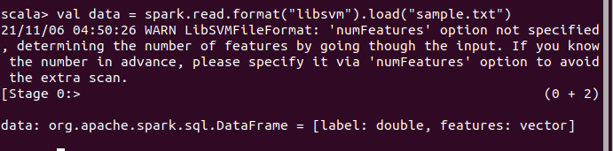
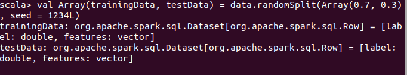
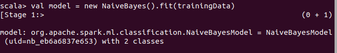
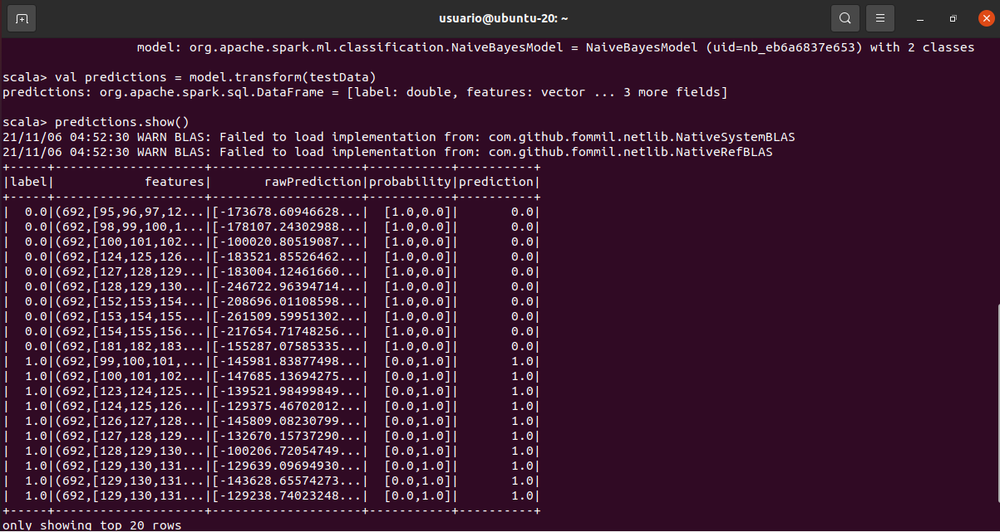
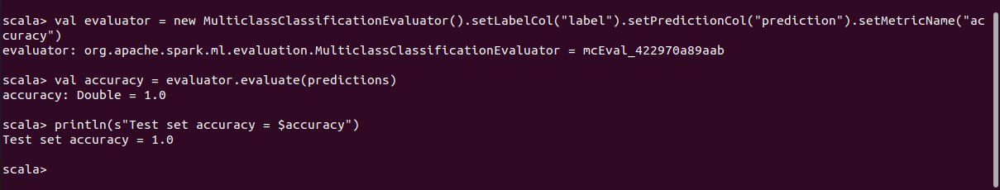

<p align="center">
    
</p>

<H2><p align="Center">TECNOLÓGICO NACIONAL DE MÉXICO</p></H2>

<H2><p align="Center">INSTITUTO TECNOLÓGICO DE TIJUANA</p></H2>

<H2><p align="Center">SUBDIRECCIÓN ACADÉMICA</p></H2>

<H2><p align="Center">DEPARTAMENTO DE SISTEMAS Y COMPUTACIÓN</p></H2>

<H2><p align="Center">NOMBRE DE LOS ALUMNOS: </p></H2>

<H2><p align="Center">GALAVIZ LONA OSCAR EDUARDO (N.CONTROL: 17212993)</p></H2>

<H2><p align="Center">MARQUEZ MILLAN SEASHELL VANESSA (N.CONTROL: ) </p></H2>

<H2><p align="Center">Carrera: Ingeniería Informática</p></H2>

<H2><p align="Center">Semestre: 9no </p></H2>

<H2><p align="Center">MATERIA: Datos Masivos</p></H2>

<H2><p align="Center">PROFESOR: JOSE CHRISTIAN ROMERO HERNANDEZ</p></H2>

<H2><p align="Center">Practica 7</p></H2>

<H2><p align="Center">Unidad 2</p></H2>

<br>
<br>
<br>
<br>
<br>
<br>
<br>
<br>

### Development
This is the development of the practice 7 naive bayes, this is a classification we are use to make this practice

we need to import two libraries for this, one of this is naivebayes and the other is multiclass
```scala
import org.apache.spark.ml.classification.NaiveBayes
import org.apache.spark.ml.evaluation.MulticlassClassificationEvaluator
```

We have to load de dataframa as archive text or csv
```scala
// Load the data stored in LIBSVM format as a DataFrame.
val data = spark.read.format("libsvm").load("sample.txt")
<p>

</p>
we make a split the dataframe in two parts
```scala 
// Split the data into training and test sets (30% held out for testing)
val Array(trainingData, testData) = data.randomSplit(Array(0.7, 0.3), seed = 1234L)
```
<p>

</p>

in this part we implement the model of naivebayes for a new dataframe

```scala 
// Train a NaiveBayes model.
val model = new NaiveBayes().fit(trainingData)
```
<p>

</p>
we execute the model and show the model with peditictions

```scala
// Select example rows to display.
val predictions = model.transform(testData)
predictions.show()
```
<p>

</p>

Finally we show the accuracy they have model of naivebayes

```scala
// Select (prediction, true label) and compute test error
val evaluator = new MulticlassClassificationEvaluator().setLabelCol("label").setPredictionCol("prediction").setMetricName("accuracy")
val accuracy = evaluator.evaluate(predictions)
println(s"Test set accuracy = $accuracy")
```
<p>

</p>