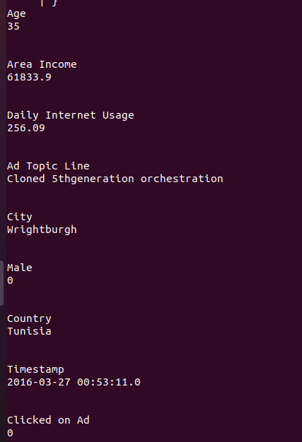
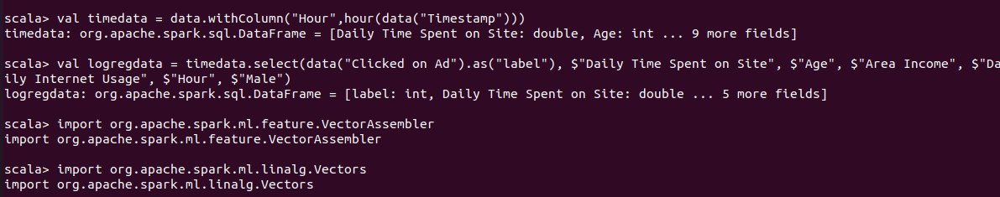
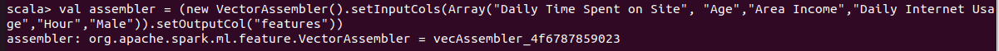
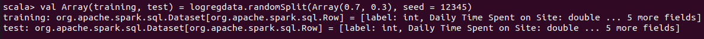
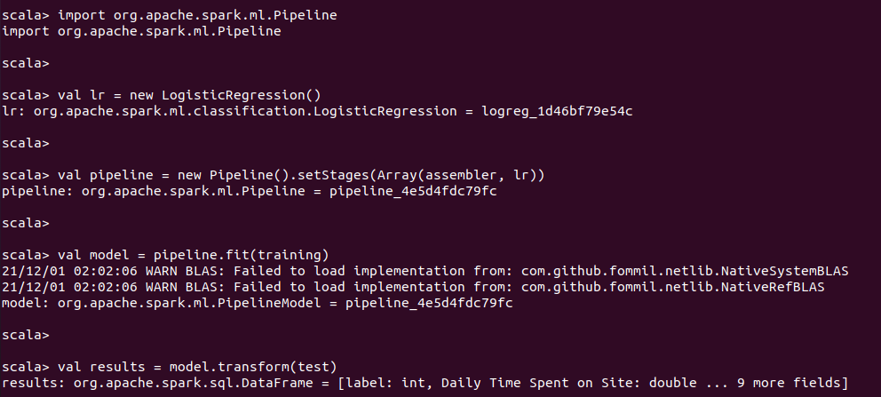
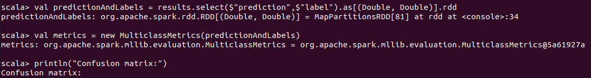
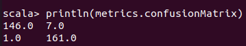
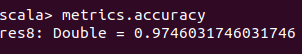

<p align="center">
    
</p>

<H2><p align="Center">TECNOLÓGICO NACIONAL DE MÉXICO</p></H2>

<H2><p align="Center">INSTITUTO TECNOLÓGICO DE TIJUANA</p></H2>

<H2><p align="Center">SUBDIRECCIÓN ACADÉMICA</p></H2>

<H2><p align="Center">DEPARTAMENTO DE SISTEMAS Y COMPUTACIÓN</p></H2>

<H2><p align="Center">NOMBRE DE LOS ALUMNOS: </p></H2>

<H2><p align="Center">GALAVIZ LONA OSCAR EDUARDO (N.CONTROL: 17212993)</p></H2>

<H2><p align="Center">MARQUEZ MILLAN SEASHELL VANESSA (N.CONTROL: ) </p></H2>

<H2><p align="Center">Carrera: Ingeniería Informática</p></H2>

<H2><p align="Center">Semestre: 9no </p></H2>

<H2><p align="Center">MATERIA: Datos Masivos</p></H2>

<H2><p align="Center">PROFESOR: JOSE CHRISTIAN ROMERO HERNANDEZ</p></H2>

<H2><p align="Center">Practica 1</p></H2>

<H2><p align="Center">Unidad 3</p></H2>

<br>
<br>
<br>
<br>
<br>
<br>
<br>
<br>


```scala
//import de logisticRegression y otros
import org.apache.spark.ml.classification.LogisticRegression
import org.apache.spark.sql.SparkSession

import org.apache.log4j._
Logger.getLogger("org").setLevel(Level.ERROR)

```

```sh
scala> import org.apache.spark.ml.classification.LogisticRegression
import org.apache.spark.ml.classification.LogisticRegression

scala> import org.apache.spark.sql.SparkSession
import org.apache.spark.sql.SparkSession

scala> 

scala> import org.apache.log4j._
import org.apache.log4j._

scala> Logger.getLogger("org").setLevel(Level.ERROR)
```

```scala
//iniciar una sesion de spark y cargar los datos e imprimir estructura
val spark = SparkSession.builder().getOrCreate()

val data  = spark.read.option("header","true").option("inferSchema", "true").format("csv").load("advertising.csv")

data.printSchema()

```

```sh
scala> data.printSchema()
root
 |-- Daily Time Spent on Site: double (nullable = true)
 |-- Age: integer (nullable = true)
 |-- Area Income: double (nullable = true)
 |-- Daily Internet Usage: double (nullable = true)
 |-- Ad Topic Line: string (nullable = true)
 |-- City: string (nullable = true)
 |-- Male: integer (nullable = true)
 |-- Country: string (nullable = true)
 |-- Timestamp: timestamp (nullable = true)
 |-- Clicked on Ad: integer (nullable = true)


```

```scala
data.head(1)

val colnames = data.columns
val firstrow = data.head(1)(0)

```

```sh
scala> data.head(1)
res2: Array[org.apache.spark.sql.Row] = Array([68.95,35,61833.9,256.09,Cloned 5thgeneration orchestration,Wrightburgh,0,Tunisia,2016-03-27 00:53:11.0,0])

scala> val colnames = data.columns
colnames: Array[String] = Array(Daily Time Spent on Site, Age, Area Income, Daily Internet Usage, Ad Topic Line, City, Male, Country, Timestamp, Clicked on Ad)

scala> val firstrow = data.head(1)(0)
firstrow: org.apache.spark.sql.Row = [68.95,35,61833.9,256.09,Cloned 5thgeneration orchestration,Wrightburgh,0,Tunisia,2016-03-27 00:53:11.0,0]

```

```scala

// Imprima un renglon de ejemplo 

println("\n")
println("Example data row")
for(ind <- Range(1, colnames.length)){
    println(colnames(ind))
    println(firstrow(ind))
    println("\n")
}
``` 
<p>

</p>

```scala
//// Preparar el DataFrame para Machine Learning ////
//creacion de una nueva columna llamada Timestamp
val timedata = data.withColumn("Hour",hour(data("Timestamp")))

//renombrar "clicked on Ad" a "label" y tomar las columnas como features
val logregdata = timedata.select(data("Clicked on Ad").as("label"), $"Daily Time Spent on Site", $"Age", $"Area Income", $"Daily Internet Usage", $"Hour", $"Male")
// Importe VectorAssembler y Vectors

// Cree un nuevo objecto VectorAssembler llamado assembler para los feature
import org.apache.spark.ml.feature.VectorAssembler
import org.apache.spark.ml.linalg.Vectors
```
<p>

</p>

```scala
val assembler = (new VectorAssembler().setInputCols(Array("Daily Time Spent on Site", "Age","Area Income","Daily Internet Usage","Hour","Male")).setOutputCol("features"))
```
<p>

</p>

```scala
// Utilice randomSplit para crear datos de train y test divididos en 70/30
val Array(training, test) = logregdata.randomSplit(Array(0.7, 0.3), seed = 12345)
```
<p>

</p>

```scala

// Configuracion del Pipeline ///////

import org.apache.spark.ml.Pipeline

val lr = new LogisticRegression()

val pipeline = new Pipeline().setStages(Array(assembler, lr))

val model = pipeline.fit(training)

val results = model.transform(test)
```

<p>

</p>

```scala
//// Evaluacion del modelo /////////////

// Para Metrics y Evaluation importe MulticlassMetrics

import org.apache.spark.mllib.evaluation.MulticlassMetrics

val predictionAndLabels = results.select($"prediction",$"label").as[(Double, Double)].rdd
val metrics = new MulticlassMetrics(predictionAndLabels)
```
<p>

</p>

```scala
println("Confusion matrix:")
println(metrics.confusionMatrix)

metrics.accuracy
```

<p>

</p>
<p>

</p>
