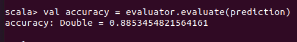

<p align="center">
    
</p>

<H2><p align="Center">TECNOLÓGICO NACIONAL DE MÉXICO</p></H2>

<H2><p align="Center">INSTITUTO TECNOLÓGICO DE TIJUANA</p></H2>

<H2><p align="Center">SUBDIRECCIÓN ACADÉMICA</p></H2>

<H2><p align="Center">DEPARTAMENTO DE SISTEMAS Y COMPUTACIÓN</p></H2>

<H2><p align="Center">NOMBRE DE LOS ALUMNOS: </p></H2>

<H2><p align="Center">GALAVIZ LONA OSCAR EDUARDO (N.CONTROL: 17212993)</p></H2>

<H2><p align="Center">MARQUEZ MILLAN SEASHELL VANESSA (17212153 ) </p></H2>

<H2><p align="Center">Carrera: Ingeniería Informática</p></H2>

<H2><p align="Center">Semestre: 9no </p></H2>

<H2><p align="Center">MATERIA: Datos Masivos</p></H2>

<H2><p align="Center">PROFESOR: JOSE CHRISTIAN ROMERO HERNANDEZ</p></H2>

<H2><p align="Center">Practice evaluatoria 4</p></H2>

<H2><p align="Center">Unidad 4</p></H2>

<br>
<br>
<br>
<br>
<br>
<br>
<br>
<br>


### Introduction 

This practice is for can see the best model for this example the data set is bank.csv is a data set about  related with direct marketing campaigns (phone calls) of a Portuguese banking institution. The classification goal is to predict if the client will subscribe a term deposit (variable y) and we try to do a prediction with teh models: SVM, Desicion tree, logistic regresion and multilayer perceptron those are machine learning models but supervised that is to say is a subcategory of machine learning and artificial intelligence. It is defined by its use of labeled datasets to train algorithms that to classify data or predict outcomes accurately. As input data is fed into the model, it adjusts its weights until the model has been fitted appropriately, which occurs as part of the cross validation process. Supervised learning helps organizations solve for a variety of real-world problems at scale, such as classifying spam in a separate folder from your inbox.

In these case we used this types of models for create a comparation in this and obtaing valius information abou wich is the best in these case in spesific we based in the accuaracy and the error, and try to explain more about this models too.
<br>

**Theoretical framework**
<br>
- SVM
- Decision Three
- Logistic Regresion
- Multilayer perceptron
  
Start talk about the each of the models like SVM is a supervised machine learning algorithm that can be used for both classification or regression challenges. However,  it is mostly used in classification problems. In the SVM algorithm, we plot each data item as a point in n-dimensional space (where n is a number of features you have) with the value of each feature being the value of a particular coordinate. Then, we perform classification by finding the hyper-plane that differentiates the two classes very well, now let's move on to Decision three are a non-parametric supervised learning method used for classification and regression. The goal is to create a model that predicts the value of a target variable by learning simple decision rules inferred from the data features. A tree can be seen as a piecewise constant approximation, decision trees learn from data to approximate a sine curve with a set of if-then-else decision rules. The deeper the tree, the more complex the decision rules and the fitter the model, while logistic regresion is a supervised learning classification algorithm used to predict the probability of a target variable. The nature of target or dependent variable is dichotomous, which means there would be only two possible classes so the dependent variable is binary in nature having data coded as either 1 (stands for success/yes) or 0 (stands for failure/no) and multilayer perception is a neural network where the mapping between inputs and output is non-linear, has input and output layers, and one or more hidden layers with many neurons stacked together. And while in the Perceptron the neuron must have an activation function that imposes a threshold, like ReLU or sigmoid, neurons in a Multilayer Perceptron can use any arbitrary activation function.

### Implementation
<br>
Why we used scala and spark like work environment?

Well Scala is a functional language, so computing can be distributed across the cores in a multicore server and across the servers in a Data Center. This makes Scala especially a great choice for multi-core CPUs and Cloud Coumputing distributed workloads. Learning Scala is indispensable for Big Data analysis scenarios and spark enables developers to perform operations on large volumes of data in clusters quickly and with fault tolerance. When we have to handle algorithms, working in memory and not on disk improves performance.

So we decide ussed because is a so lightweight work envioment because this interfaz don't used a lot recurses and this does not go down the potential and the big power than have scala and spark and this is fantastic if work with big data because de dataset so big to do slower the recurses and the PC in general, and no it's so difficult to analizing in this type to envioroment.


### Developement

**Common Code**
<br>
Every model needs certain library and is representate like here

```scala
import org.apache.spark.sql.SparkSession
import org.apache.spark.ml.classification.LinearSVC
import org.apache.spark.mllib.evaluation.MulticlassMetrics
import org.apache.spark.ml.linalg.Vectors
import org.apache.spark.ml.feature.StringIndexer
import org.apache.spark.ml.feature.VectorIndexer
import org.apache.spark.ml.feature.VectorAssembler
import org.apache.spark.ml.Pipeline
```

To do more small the error 
```scala
import org.apache.log4j._
Logger.getLogger("org").setLevel(Level.ERROR)
```

Create a new session on spark 
```scala
val spark = SparkSession.builder.appName("svm").getOrCreate()
```

Load the data set correspondet 
```scala
val df  = spark.read.option("header","true").option("inferSchema", "true").option("delimiter",";").format("csv").load("bank-full.csv")
df.head()
df.describe()
```

Define the colum "Y" like index
```scala
val labelIndexer = new StringIndexer().setInputCol("y").setOutputCol("indexedY").fit(df)
val indexed = labelIndexer.transform(df).drop("y").withColumnRenamed("indexedY", "label")   
```

Made the vector with the number columns in features
```scala
val vectorFeatures = (new VectorAssembler().setInputCols(Array("balance","day","duration","pdays","previous")).setOutputCol("features"))
```

Here transform feaure
```scala
val featurestrans = vectorFeatures.transform(indexed)
```

Join columns feature and label
```scala
val dataindexed = featureslabel.select("label","features")
dataindexed.show()
```

Creation of labelindex and featureindex for pipeline
```scala
val labelindexer = new StringIndexer().setInputCol("label").setOutputCol("indexedlabel").fit(dataindexed)
val featureIndexer = new VectorIndexer().setInputCol("features").setOutputCol("indexedfeatures").setMaxCategories(4).fit(dataindexed)
```

And training test and data 
```scala
val Array(training, test) = dataindexed.randomSplit(Array(0.7, 0.3), seed = 1234L)
```
Is importat to sai only some this steps there are used on the models, sometimes can changed.
<br>

**SVM**

As we sai some steps on the code is so similar so here only explain the specific steps like these is where define the model, we define the max iteraccion and the param is go to train with differents.

```scala
val supportVM = new LinearSVC().setMaxIter(10).setRegParam(0.1)
```

Here train to model and need to transfor the test after we see the prediction

```scala
val modelSVM = supportVM.fit(training)

val predictions = modelSVM.transform(test)
predictions.show()
```

Here is a so important step because is the result and to do de metrics with the prediction, too to do the cofusion matrix for to do more real the results and print the accuacy and test error

```scala
val predictionAndLabels = predictions.select($"prediction",$"label").as[(Double, Double)].rdd
val metrics = new MulticlassMetrics(predictionAndLabels)

println("Confusion matrix:")
println(metrics.confusionMatrix)

println("Accuracy: " + metrics.accuracy) 
println(s"Tst Error = ${(1.0 - metrics.accuracy)}")
spark.stop()
```
**RESULT**
<br>
This is a example to result and repet the process 30 times
```spark
Confusion matrix: 
12039.0  22.0  
1599.0   22.0 
Accuracy: 0.8833238995004502
Tst Error = 0.12047610058865769
```

**Results SVM**

| Iter | SVM | 
| ------------- | ------------- |
| 1  | 0.8833 |
| 2  | 0.8835 |
| 3  | 0.8877 |
| 4  | 0.8820 |
| 5  | 0.8836 |
| 6  | 0.8865 |
| 7  | 0.8846 |
| 8  | 0.8797 |
| 9  | 0.8837 |
| 10 | 0.8838 |
| 11 | 0.8799 |
| 12 | 0.8839 |
| 13 | 0.8805 |
| 14 | 0.8830 |
| 15 | 0.8818 |
| 16 | 0.8805 |
| 17 | 0.8852 |
| 18 | 0.8811 |
| 19 | 0.8836 |
| 20 | 0.8796 |
| 21 | 0.8874 |
| 22 | 0.8865 |
| 23 | 0.8819 |
| 24 | 0.8823 |
| 25 | 0.8841 |
| 26 | 0.8878 |
| 27 | 0.8793 |
| 28 | 0.8874 |
| 29 | 0.8856 |
| 30 | 0.8842 |

**AVERAGE: 0.883466667** 

**DesicionTree**

In these case start with the train of the model and we convert the the news labels too after start with pipeline than we help to do the predictions.

```scala
val dt = new DecisionTreeClassifier().setLabelCol("indexedLabel").setFeaturesCol("indexedFeatures")

val labelConverter = new IndexToString().setInputCol("prediction").setOutputCol("predictedLabel").setLabels(labelIndexer.labels)
val pipeline = new Pipeline().setStages(Array(labelIndexer, featureIndexer, dt, labelConverter))

```

An this is the final is the results, here used the pipeline and the trainingdata, after to do the prediction with the test data  after print the prediction, the last part is evalute the prediction and print the accuracy and test error.

```scala
val model = pipeline.fit(trainingData)

val predictions = model.transform(testData)
predictions.select("predictedLabel", "label", "features").show(5)

val evaluator = new MulticlassClassificationEvaluator().setLabelCol("indexedLabel").setPredictionCol("prediction").setMetricName("accuracy")
val accuracy = evaluator.evaluate(predictions)
println(s"Test error = ${(1.0 - accuracy)}")
```
**RESULT**
<br>
This is a example to result and repet the process 30 times
```spark
Accuracy = 0.8907792083876189
Test Error = 0.10933129159924048
```


| Iter | DescTree | 
| ------------- | ------------- |
| 1  | 0.8907 |
| 2  | 0.8951 |
| 3  | 0.8940 |
| 4  | 0.8901 |
| 5  | 0.8867 |
| 6  | 0.8809 |
| 7  | 0.8887 |
| 8  | 0.8903 |
| 9  | 0.8899 |
| 10 | 0.8804 |
| 11 | 0.8874 |
| 12 | 0.8856 |
| 13 | 0.8912 |
| 14 | 0.8903 |
| 15 | 0.8878 |
| 16 | 0.8908 |
| 17 | 0.8856 |
| 18 | 0.8889 |
| 19 | 0.8875 |
| 20 | 0.8806 |
| 21 | 0.8874 |
| 22 | 0.8803 |
| 23 | 0.8907 |
| 24 | 0.8845 |
| 25 | 0.8874 |
| 26 | 0.8899 |
| 27 | 0.8867 |
| 28 | 0.8907 |
| 29 | 0.8887 |
| 30 | 0.8840 |

**AVERAGE: 0.88776** 


**Logistic Regression**

In this model we start the explanation from the model since all the models are using the same data repository, in this model we start from the preparation of the vectors and the already established indexers
```scala
val data2 = assembler.transform(cleanData)

val featuresLabel = data2.withColumnRenamed("y", "label")

val finaldata = featuresLabel.select("label","features")
```
<br>
we proceed to divide the dataset to calculate and implement the logistic regression model

```scala

val Array(training, test) = finaldata.randomSplit(Array(0.7, 0.3), seed = 1234)
```

in this part we made a implementation of the model for obtain the results over data repository
```scala
val lr = new LogisticRegression()

val model = lr.fit(training)

val results = model.transform(test)
```
we import the last library for the last step and obtain the most important results in this case the precision
```scala
import org.apache.spark.mllib.evaluation.MulticlassMetrics

val predictionAndLabels = results.select($"prediction",$"label").as[(Double, Double)].rdd
val metrics = new MulticlassMetrics(predictionAndLabels)
```

for the last step we have to show the results of accuracy

```scala
println("Confusion matrix:")
println(metrics.confusionMatrix)

metrics.accuracy
println(s"Accuracy=${metrics.accuracy}")
```
<p>

</p>

| Iter | LogiReg | 
| ------------- | ------------- |
| 1  | 0.8959 |
| 2  | 0.8959 |
| 3  | 0.8959 |
| 4  | 0.8959 |
| 5  | 0.8959 |
| 6  | 0.8959 |
| 7  | 0.8959 |
| 8  | 0.8959 |
| 9  | 0.8959 |
| 10 | 0.8959 |
| 11 | 0.8959 |
| 12 | 0.8959 |
| 13 | 0.8959 |
| 14 | 0.8959 |
| 15 | 0.8959 |
| 16 | 0.8959 |
| 17 | 0.8959 |
| 18 | 0.8959 |
| 19 | 0.8959 |
| 20 | 0.8959 |
| 21 | 0.8959 |
| 22 | 0.8959 |
| 23 | 0.8959 |
| 24 | 0.8959 |
| 25 | 0.8959 |
| 26 | 0.8959 |
| 27 | 0.8959 |
| 28 | 0.8959 |
| 29 | 0.8959 |
| 30 | 0.8959 |

**AVERAGE: 0.8959** 

we establish the parameters for the model and we can carry out the implementation
```scala
val trainer = new MultilayerPerceptronClassifier().setLayers(layers).setLabelCol("indexedLabel").setFeaturesCol("indexedFeatures").setBlockSize(128).setSeed(1234L).setMaxIter(100)


val labelConverter = new IndexToString().setInputCol("prediction").setOutputCol("predictedLabel").setLabels(labelIndexer.labels)
```
We proceed to establish the parameters within a pipeline that will be taken into account for the realization of the model, once done we implement the model in the divided dataset
```scala
val pipeline = new Pipeline().setStages(Array(labelIndexer, featureIndexer, trainer, labelConverter))

val model = pipeline.fit(training)

val prediction = model.transform(test)
prediction.select("prediction", "label","features").show(5)
```
<p>

</p>

for the step we show the result with obtain the accuracy 
```scala
val evaluator = new MulticlassClassificationEvaluator().setLabelCol("indexedLabel").setPredictionCol("prediction").setMetricName("accuracy")

val accuracy = evaluator.evaluate(prediction)
```
<p>

</p>

**Multilayer Perceptron**
| Iter | MultiPerc | 
| ------------- | ------------- |
| 1  | 0.8853 |
| 2  | 0.8853 |
| 3  | 0.8853 |
| 4  | 0.8853 |
| 5  | 0.8853 |
| 6  | 0.8853 |
| 7  | 0.8853 |
| 8  | 0.8853 |
| 9  | 0.8853 |
| 10 | 0.8853 |
| 11 | 0.8853 |
| 12 | 0.8853 |
| 13 | 0.8853 |
| 14 | 0.8853 |
| 15 | 0.8853 |
| 16 | 0.8853 |
| 17 | 0.8853 |
| 18 | 0.8853 |
| 19 | 0.8853 |
| 20 | 0.8853 |
| 21 | 0.8853 |
| 22 | 0.8853 |
| 23 | 0.8853 |
| 24 | 0.8853 |
| 25 | 0.8853 |
| 26 | 0.8853 |
| 27 | 0.8853 |
| 28 | 0.8853 |
| 29 | 0.8853 |
| 30 | 0.8853 |

**AVERAGE: 0.8853** 

**Comparative table**
| Iter | SVM | DescTre| LogiReg | MultiPerc| 
| ------------- | ------------- |---------|------|--------|
| 1  | 0.8833 | 0.8907 | 0.8959 | 0.8853 |
| 2  | 0.8835 | 0.8951 | 0.8959 | 0.8853 |
| 3  | 0.8877 | 0.8940 | 0.8959 | 0.8853 |
| 4  | 0.8820 | 0.8901 | 0.8959 | 0.8853 |
| 5  | 0.8836 | 0.8867 | 0.8959 | 0.8853 |
| 6  | 0.8865 | 0.8809 | 0.8959 | 0.8853 |
| 7  | 0.8846 | 0.8887 | 0.8959 | 0.8853 |
| 8  | 0.8797 | 0.8903 | 0.8959 | 0.8853 |
| 9  | 0.8837 | 0.8899 | 0.8959 | 0.8853 |
| 10 | 0.8838 | 0.8804 | 0.8959 | 0.8853 |
| 11 | 0.8799 | 0.8874 | 0.8959 | 0.8853 |
| 12 | 0.8839 | 0.8856 | 0.8959 | 0.8853 |
| 13 | 0.8805 | 0.8912 | 0.8959 | 0.8853 |
| 14 | 0.8830 | 0.8903 | 0.8959 | 0.8853 |
| 15 | 0.8818 | 0.8878 | 0.8959 | 0.8853 |
| 16 | 0.8805 | 0.8908 | 0.8959 | 0.8853 |
| 17 | 0.8852 | 0.8856 | 0.8959 | 0.8853 |
| 18 | 0.8811 | 0.8889 | 0.8959 | 0.8853 |
| 19 | 0.8836 | 0.8875 | 0.8959 | 0.8853 |
| 20 | 0.8796 | 0.8806 | 0.8959 | 0.8853 |
| 21 | 0.8874 | 0.8874 | 0.8959 | 0.8853 |
| 22 | 0.8865 | 0.8803 | 0.8959 | 0.8853 |
| 23 | 0.8819 | 0.8907 | 0.8959 | 0.8853 |
| 24 | 0.8823 | 0.8845 | 0.8959 | 0.8853 |
| 25 | 0.8841 | 0.8874 | 0.8959 | 0.8853 |
| 26 | 0.8878 | 0.8899 | 0.8959 | 0.8853 |
| 27 | 0.8793 | 0.8867 | 0.8959 | 0.8853 |
| 28 | 0.8874 | 0.8907 | 0.8959 | 0.8853 |
| 29 | 0.8856 | 0.8887 | 0.8959 | 0.8853 |
| 30 | 0.8842 | 0.8840 | 0.8959 | 0.8853 |
| AVG | 0.883466667 | 0.88776 | 0.8959 | 0.8853 |

# Explian about results 

The results that we obtained were very varied as far as the models are concerned, some will not change their precision results and others their changes were small, giving 0.01 or 0.02, sometimes they were numbers further away than in decimal places. But thanks to the results, the different models are long or short in the execution process, having as the fastest model the logistic regression and the slowest the multilayer percetron, as the best in terms of precision, there is not one as such, since All had a similar precision in terms of the process of the 30 executions of each of the models, in any case it would be logistic regression in which it has better precision only by a small fraction of a decimal of 0.01 in other words 1%, all the model had a fairly high precision almost reached 0.9 which translates as 90%, the 4 models have a similar precision since none had a different precision I can say that the 4 precision models are quite good, maybe it is because of my computer that look like this.

# Conclusion
Los modelos son diferentes en cuanto a la realizacion de procesas ya que cada modelo esta implementado o centrado para ciertos trabajos como el modelo de regresion logistica que hace comparaciones de 1 a 1, algunos de estos modelos como ya mencione estan dedicados para ciertas tareas que pueden realizar, al igual que otros modelos que no se vieron pero realizan tarea similiras en este caso sacar estadisticas, probabilidades y calculos que se requieran, estos modelos son algunos de los que utilizamos para nuestro proyecto final el cual nos deja en claro que si puede variar los resultados por muy pequeños que sean, algunos nos demostraran que su tiempo de ejecucion es el mas rapido o el mas lento, indenpendientemente del codigo ya que es el mismo repositorio de datos realizando funciones diferente. En conclusion podemos decir que los modelos tienes sus diferentes caracteristicas que los hace diferentes de los otros modelos y que nos permiten poder experimentarlos y comprobar por nuestros propias manos que son modelos que funcionan, que se utilizan y que pueden tener resultados para un repositorio de datos asi el cambio que pueden tener en su rendimiento estos nos ayuda a comprender un poco mas lo modelos que estamos utilizando, para que sirven y como debemos utilizarlos para adaptarnos a lo que nos pide un problema.

# Referencias

1. Chacha, C. B. R. (2019, 3 diciembre). Student Dropout Model Based on Logistic Regression. SpringerLink. https://link.springer.com/chapter/10.1007/978-3-030-42520-3_26?error=cookies_not_supported&code=f95c5d32-5a47-432c-9e88-3ce3f417716d
2. Dorado-Moreno, M. (2015, 10 junio). Nonlinear Ordinal Logistic Regression Using Covariates Obtained by Rad. SpringerLink. https://link.springer.com/chapter/10.1007/978-3-319-19222-2_7?error=cookies_not_supported&code=99bb699c-b3da-46d0-80ba-ca55685c53b0
3. Basic Statistical Analysis of SVMs. (2008). SpringerLink. https://link.springer.com/chapter/10.1007/978-0-387-77242-4_6?error=cookies_not_supported&code=6174a648-3ea1-4b5d-a36b-a0d1d2e165fb
4. Zhang, X. (2017). Support Vector Machines. SpringerLink. https://link.springer.com/referenceworkentry/10.1007/978-1-4899-7687-1_810?error=cookies_not_supported&code=7de39821-672e-4b4c-8dd7-d5ad1f5f03b7
5. Garcés, R. C. (2021). Cáncer de cérvix y autorresponsabilidad: perfilando el riesgo de abstención al Papanicolaou entre las mujeres chilenas mediante Árboles de Decisión. Garces. http://www.scielo.org.pe/scielo.php?pid=S1727-558X2018000100003&script=sci_arttext&tlng=en
6. Trujillano, J. (2008, 1 enero). Aproximación a la metodología basada en árboles de decisión (CART). Mortalidad hospitalaria del infarto agudo de miocardio | Gaceta Sanitaria. Javier. https://www.gacetasanitaria.org/es-aproximacion-metodologia-basada-arboles-decision-articulo-S0213911108712044
7. Classification and regression - Spark 3.2.0 Documentation. (2021). Machine learning. https://spark.apache.org/docs/latest/ml-classification-regression.html#decision-tree-classifier
8. Brownlee, J. (2020, 15 agosto). Crash Course On Multi-Layer Perceptron Neural Networks. Machine Learning Mastery. https://machinelearningmastery.com/neural-networks-crash-course/
9. Extreme Learning Machine for Multilayer Perceptron. (2016, 1 abril). IEEE Journals & Magazine | IEEE Xplore. https://ieeexplore.ieee.org/document/7103337
10. Taravat, A. (2021). Multilayer Perceptron Neural Networks Model for Meteosat Second Generation SEVIRI Daytime Cloud Masking. MDPI. https://www.mdpi.com/2072-4292/7/2/1529

